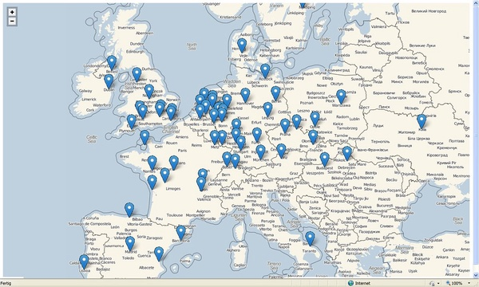

# HIST 3814: Week One

## Tutorial: Markdown

I am currently starting my third year at Carleton University as a History student. Thus far I have mainly only had the chance to do reflections, annotations and **lots** of essays. _However_, this past fall I took a course called *HIST 2811: Public History*: *Memory to Museums* with Professor David Dean. I went into this course unsure of what to expect, but it helped me see history in a different perspective and I learnt that **history can* be more than just essays**. Which really excited me.

My favourite assignment from HIST 2811 was called _Mapping History_. In this assignment we got to choose any topic of interest we wanted to do research on, as long as it was something that could be tracked.

The objective of the assignment was to use a mapping system to get a better understanding of the topic we chose. Using a Geographic Information System,_Google My Maps_ I told the story of the Mona Lisa, **_one of the most famous paintings in the world_**.

The map I created shows all the places that the Mona Lisa has been during its 500 years of history, included:
1. Where the painting was created,
2. The places the painting has been displayed,
3. Where and when the panting was stolen,
4. Then, where the Mona Lisa was found.

You can check out my map [here](https://www.google.com/maps/d/edit?mid=1nsRKLqBOvFKQq9LlZOC29Wa6oAdkq8hZ&usp=sharing)
