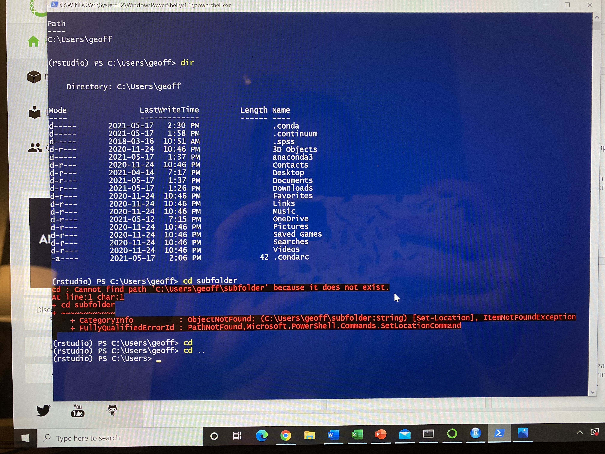

# Log: Week One

## Newcomer Sequence

1. __Markdown__
- When I first saw the cheatsheet of markdown, I was a little intimidated and couldn't understand **why** we would take the time to use it. _Just another thing to try to memorize._ Embarrassingly, I didn't realize that I didn't have to put the underscores or asterisks between every word in a sentence that I wanted to _italics_ or **bold** until I saw an example of **Nicholas Surges** work. So, thank you **Nicholas** for making my life a million times easier!
However, after writing the tutorial paragraph, it became less intimidating and actually easier to use than its word. Although, I'm still unsure if my pictures and website will be embedded properly. I used atom as
  - I Just learnt that I can preview my markdowns by going to __packages__, down to __markdown preview__, and selecting __toggle preview__.
  - My website link did not work at first. I wasn't sure what had gone wrong here, so I recopied the link and pasted it. That still did not work. _However,_ I realized that when I pasted the link, it was spaced apart in an area. Deleting the space connected the link and now it works.

2.  __Github__
- Honestly, not really sure I understand what I am doing. However, no issues with creating an account and repository.
  - I selected "_create a new repository_", named it _week-one_, made sure it was on public, and selected "_initialize this repository with a README_", clicked "_create repository_". I was brought to a new page which shows my repository, I went to "_settings_", "_manage access_" and "_invite collaborator_". I invited Dr. Graham, through his user name _shawngraham_.
- I used the "_upload file_" and "_drag and drop_"
- Did not have any issues with using Github. Not too sure if I'm supposed to do the "**going further**" part, but skipped for now, I felt very overwhelmed and confused.

3. __Anaconda__
- So this is where everything went downhill for me. **Real quick.** For whatever reason (Probably because my computer is old and slow) trying to download anaconda just was not happening for me. (The only option I had for download was _Python 3.8 64-Bit Graphical Installer (440 MB)_)
  - First froze my laptop. I had to wait for it to die, charge and then try again.
  - Second time trying, I got through the prompts and then got the message of "_The Installation failed_" 
  - So, I deleted anaconda from my laptop and tried again. Following the exact steps outlined [here](https://docs.anaconda.com/anaconda/install/mac-os/) for installing anaconda to macOS.
  - Third time around it downloaded, got through all the prompts without an issue. __HOWEVER__, none of the of the applications within the anaconda would launch. I would click on _RStudio_ and the loading bar would say "_launching RStudio_" but nothing would happen.
  - I tried restarting the app, then restarting my laptop and *__nothing__*. My laptop froze again.

      - Did reach out to a friend who is in his fourth year of computer science at Carleton for some insight on my issues. (Felt more comfortable asking a friend, since my assignment was late.) He also uses macOS. He wasn't sure what was happening when I showed him through FaceTime.
      - Tried to delete some old files and apps that I no longer use to free up some space, since Anaconda is a large file.
      - My friend downloaded Anaconda to see if he would have issues, following the guide that I did online (basically just following the prompts and re-clicking "_install for me only_" as the guide suggests.) It worked fine for him. So, I do believe that the issues I am having is due to having an older generation. _Though I could be wrong, I really don't know much about computers_.

- I gave up on my laptop, had to wait to borrow my boyfriend's laptop on Monday, May 17. 4 days after this assignment is due.
  - Now using a windows laptop. (Which I'm pretty lost on, I have only used Mac systems for the past 6 years. But, I am hopeful.)
  - Downloaded _Python 3.8, 64-Bit Graphical Installer (477 MB)_ for Windows. Made it through all the prompts without any issue, seems to have downloaded properly.
  - Now installing _Powershell Prompt._ Took awhile to install/ launch. But so far so good. To make sure everything is installed, I typed in "_conda --version_" got "_conda 4.10.1_" in return, next typed "_python --version_" got "_python 3.6.13 :: Anaconda, Inc_" in return. So things are looking up!
  - Following prompts from **Navigating the Commandline**: Not sure if if this is an issue,  but other than that everything seems to be working.

4. **Cleaning & Manipulating Data with R:**
- Just a side note: _The Survey of Scottish Witchcraft_ sounds super interesting, will have to go back a more thorough read!

- *__Moment of truth:__* Installing _RStudio._
    - A new error has arisen
    
    - Selected "_create_", not really sure what this did, however, RStudio now works!
- Opened _RStudio,_ typing in "_install.packages("tidyverse")_", and then "_install.packages("tidy text")_" I don't believe there was any issues, a lot of code came up. The last few lines all say "successfully unpacked". So that is a good sign.
- Next, I typed in "_library(tidyverse)._" It came up with a **warning message** "packages(s) built under R version 3.6.3".
- "_library(magrittr)_" and _"library("tidytext")"_ came with the same **warning message.**

- Not really sure if this will be an issue.
  - Checked the discord group, and it seems that the "_built under R version 3.6.3_" doesn't matter. So that is a relief.
- **Loading your data** ran in to many, many, many problems here.
    1. The instructions say to _right-click and save as to the folder where you're working with R OR copy the url and change the cold below appropriately._ (code being '_read_csv_' or '_read_url_') __However__ did not specify that when you're saving to the folder, to _save as_ fairy-elements.**csv**. I could not understand why it wasn't working for me, it just kept coming up with error codes, the _url_ path was not working for me either. So, **desperately** I tried saving the website as with **.csv** and it worked. Kind of.
    2. So after trying the "fairyElements <- read_csv("fairy-elements.csv")" every way imaginable, I finally got something. __BUT__ it was a bunch of error codes basically. 
